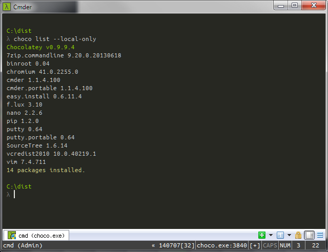

# Choco

## Установка
 - Используя *Command Prompt* с правами администратора:

> `C:\> @powershell -NoProfile -ExecutionPolicy unrestricted -Command "iex ((new-object net.webclient).DownloadString('https://chocolatey.org/install.ps1'))" && SET PATH=%PATH%;%ALLUSERSPROFILE%\chocolatey\bin`

 - Используя *Powershell* с правами администратора:

> `PS:\>iex ((new-object net.webclient).DownloadString('https://chocolatey.org/install.ps1'))`

## Интернет
 - Mozilla Firefox `C:\> choco install firefox`
     + Waterfox `C:\> choco install waterfox`
 - Chromium `C:\> choco install chromium`
 - Pidgin `C:\> choco install pidgin`
 - Mozilla Thunderbird `C:\> choco install thunderbird`

## Медиа
 - AIMP `C:\> choco install aimp`
 - foobar2000 `C:\> choco install foobar2000`
 - VLC `C:\> choco install vlc`
 - MPC-HC `C:\> choco install mpc-hc`

## Разработка
 - Nano `C:\> choco install nano`
 - Vim `C:\> choco install vim`
 - Sublime Text 3 `C:\> choco install sublimetext3`
     + Package Control `C:\> choco install sublimetext3.packagecontrol `
 - Brackets `C:\> choco install brackets`
 - Haroopad `C:\> choco install haroopad`
 - PyCharm Community `C:\> choco install pycharm-community`
 - Visual Studio Community 2013 `C:\> choco install visualstudiocommunity2013`

## Утилиты
 - Sumatra PDF `C:\> choco install sumatrapdf`
 - ShareX `C:\> choco install sharex`
 - Cmder `C:\> choco install cmder`
 - KeePass Password `C:\> choco install keepass`
 - Git `C:\> choco install git`
 - GitHub for Windows `C:\> choco install githubforwindows`
 - SourceTree `C:\> choco install sourcetree`
 - VMware Player `C:\> choco install vmwareplayer`

## Синхронизация
 - Dropbox `C:\> choco install dropbox`
 - Google Drive `C:\> choco install googledrive`